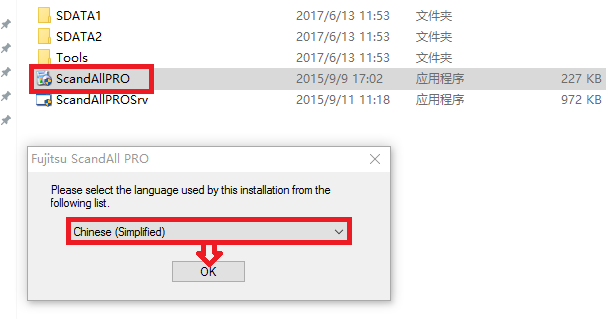
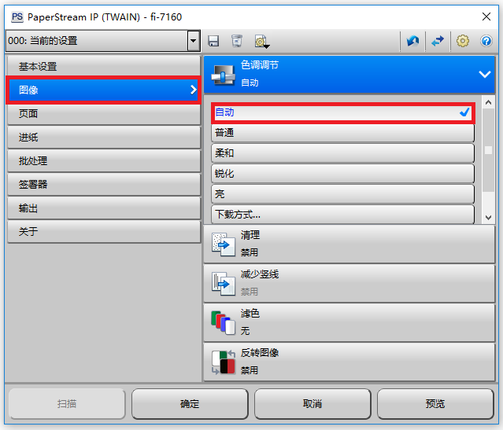
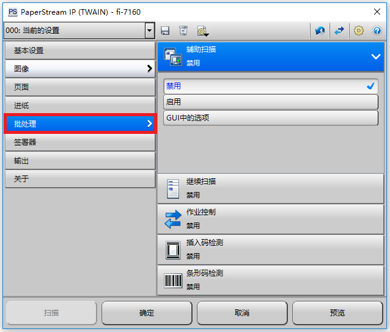


## 1) Fujitsu Fi-7160

As aforementioned, BDRC works together alongside Harvard University for storing and archiving digital works. 

# **Downloading Scanning Software**

There are many kinds of scanners; You can read more about scanners 

[here](http://www.fujitsu.com/cn/services/)

In this guide, we’ll talk about two kinds of scanners from Fujitsu (???) that we like for BDRC work. These are: 

Digitizing with either of these scanners requires installing some specialized software on your computer

There are two possibilities for installing this software: 

1. Installing from a disk (ie, pendrive) 

2. Installing from the internet

## 1. Installing the TWAIN and ISIS Drivers **(fi-7160)**

If you have the disk, follow the instructions provided. Below, we’ll give instructions for the second option, downloading the necessary software from the internet:

To download the two PaperStream drivers, visit [this page](http://www.fujitsu.com/cn/support/products/computing/peripheral/scanners/fi/software/fi-7x60.html ).

Click on both [TWAIN](http://www.fujitsu.com/cn/support/products/computing/peripheral/scanners/fi/software/ps-ip-twain32.html) and [ISIS](http://www.fujitsu.com/cn/support/products/computing/peripheral/scanners/fi/software/isis-fi-7x80.html) links to download and save the drivers. You’ll have to wait a bit as each download (you’ll see the notification pop up letting you know they’re downloading).  

After downloading both drivers, navigate to your download folder and install them. Double-click on the (.exe); hit "Next." 

On the following page, make sure all the boxes are checked ("1" & “2”) and click “Next” (“3”). 

As in the example above, check the box (accept the terms of use), and "Install" the driver. 

ScandALL PRO is the software used for scanning in this manual, and our "best practices" software recommendation for making digital objects for BDRC. 

There are two ways to download the ScandALL PRO software: 

1. From a disk (a pendrive or other)

2. From the internet

In this manual, we’ll describe how to download ScandALL PRO from the internet... 

[Visit this site](https://www.pfu.fujitsu.com/registration/scandallpro/en/form.html) for the form you’ll need to fill out to download ScandALL PRO from the internet. Here, we’ve given an example of how to fill the form out. The first two sections will need to be filled in with the PART and SERIAL numbers from your own scanner (fi-7160). They should be located on the back (or bottom) of your machine. Fill in the third (and fourth, confirmation) section with your own email address.  

Click "Next." Review your entries and make any corrections needed.  

Finally, click "Send." If the information is correct, you should soon receive an email from Fujitsu with a **username** and **password** for downloading ScandALL PRO. 

Navigate to your email. You should receive an email like the one above.  

Follow the link; you’ll find access to three kinds of software (in red), the first of which is ScandALL PRO. 

Enter the username and password you got in your email (it’s easiest to use "copy/paste," ctrl+c ctrl+v) and download ScandALL PRO.

Navigate to the download folder on your computer. You should find find the (.exe) for installing ScandALL PRO there (SAPV213.exe). Double-click it and follow the installation instructions. Next, navigate to ScandALL PRO (take a look at the example picture here) and open it.   

Now, you should be able to choose your language. (Either "Chinese [Simplified]" or “English,” depending on what you’re more comfortable with).  

Take a closer look at the example screenshots above for the steps needed. Once you’ve followed each of the steps, ScandALL PRO should be fully downloaded and installed. Check your desktop for a shortcut to ScandALL PRO. 

**Creating New Folders**

If you’re about to scan, you’ll first want to make folders to hold the new files. The process is as follows (in the example screenshots):  

First, navigate to the folder where you’d like to put your new folders. (In this example, we’re putting our new folders directly on the desktop). Right-click and select "New Folder" (F). A new folder will appear, with its new name highlighted, ready to be changed. Name the folder.  

Here, we’ve followed the process twice, creating two new folders on our desktop. We’ve named them "AA-150" and “AA-400.” Create a new folder for each work that you are planning on scanning. Name them according to BDRC convention.  

# **3. Scanning (fi-7160)**

First, make sure you’ve installed the 2 drivers (TWAIN and ISIS) and set up the scanning software (ScandALL PRO). After that, you should’ve also created the new folders where you’ll be organizing your scanned images. 

Make sure your scanner is plugged in and turned on. Now you’re ready to begin scanning. Open ScandALL PRO by double-clicking the icon (there should be a shortcut on your desktop). Next, select the "Scanner Settings" icon (in red); or, find it under “Scan” in the menu options (also shortcut **ctrl+n**). 

The first option points to the output folder; select the folder you created in the previous step by clicking the top right button (red box "1"). Navigate to the folder you created for the work you’re scanning (red box “2”). Then, hit “okay” (red box “3”). 

The second option sets the starting page number of the work you’ll be scanning (here, we’ve set it to 0001). By clicking on the button (red box "2"), you’ll be able to set the progression of image numbering (see example screenshots). In the screenshot above, our red arrows point out where you can set the naming convention of scanned images, which can be given page numbers and/or dates. For BDRC use, we’ll only need page numbers. Set (H) to 1 (red “1”), (P) to 1 (red “2”), and select (Y) of the two options (red “3”). Then, hit “Okay.” 

The third option sets the image quality. To meet BDRC standards, this setting **must** be JPEG 2000 (.j2k). In the fourth option, select () that we’ve highlighted here (outlined in red). 

 Then, click on the button (G) in the lower left-hand corner. This will open the TWAIN Driver settings menu. 

From the drop-down menu, select () (outlined here in red). In the upper, right-hand corner, you’ll see a double-arrow icon (outlined here in red). Click on it. This will reveal detailed menu options for the TWAIN Driver Settings.

**TWAIN Driver Settings:** 

1. () Basic Settings

    1. Image Mode = **Color**

    2. Paper Source = **Feeder (Both Sides) **

    3. Resolution = **400 dpi** 

    4. Paper Size = **Physical Measurement** 

    5. *Default (off) *

    6. *Default (off) *

2. Image = **Default Settings ** 

3. Page 

    7. *Default (?)*

    8. *Default (?) *

    9. Rotation = **90 for ****_pechas_****, 180 for books** 

    10. Edge Detection??? = **Disabled **(??)

4. Paper Feeding = *default*

5. Batch 

    11.  = **Disabled **(??)

6. Endorser 

    12.  = **Disabled **(??)

7. Output

    13. **JPG Compression = 6**

8. About 

## **2sic Settings** 

**1.a)** **Image Mode**

Above is a screenshot of the Driver menu options. In the first menu (outlined in red), make sure you choose "Color" as the color setting (also outlined in red) in the first menu.  

**1.b) Paper Source**

After color setting is the paper source settings; select (??) for double-sided works coming through the feeder. 

**1.c) Resolution**

Following page settings are resolution settings; you **must** select 400 dpi (or higher) to meet BDRC standards. 

**1.d) Paper Size**

Next, you’ll need to set the page size. 

Our example Tibetan text measures 98mm high x 353mm wide (see screenshot settings); you’ll need to measure the physical dimensions of the text you’re scanning, and set these dimensions manually here. Measuring the text is extremely important. You **must** do this for each text you scan, or the digital images may be cut off at the edges or contain extra blank space. Above is a screenshot of how to measure your text. 

**#.#) **

The setting for ??? should be "Automatic" (??); the rest can be set to “Disabled” (??). 

**3.c) Rotation?**** **

If your Tibetan work is a traditional "*poti*"-style text, you’ll want to select a 90 degree rotation. If it’s a modern book, 180 degrees (and ?) is the better option. (See screenshot).  

**3.d) Edge Detection? **

Disable (??) edge detection?—otherwise you’ll get unwanted empty space in the margins.

**5.a-e)** **????**

Disable (??) everything in ????. 

**6****.a)** **????**

Disable (??) ????.  

**7.a) JPG Compression**

Finally, set the JPG compression to "6". All the other settings you may leave on “Default;” make sure you use these settings any time you scan for BDRC. Remember to check them each time—be especially careful to update the “Measurement” section with each scan! 

Above is a picture of the Fi-7160 scanner with a Tibetan text ready to scan; after you’ve carefully set the settings, you should be ready with a similar setup.  

You have now: 1) Created a new folder for the Work; 2) Set the software and driver settings for the Work; and 3) Physically put the Work in the scanner. You’re now prepared to scan. 

Scan by clicking on the "Scan" icon (outlined in red)—or, select “Scan” from the “Scan” option in the main menu. Make sure your settings are selected and hit “Scan??? Okay???” () to begin scanning. 

 During the scanning process, you should see the scanning software begin populating with the digital images of the text. 

After the scanner has finished scanning the text, the digital images can be found in the folder you created (in Step 1) and designated to hold the images (in Step 2). 

It’s best to open the images in a piece of software called [XnView](http://www.xnview.com/); we describe how to use XnView here (insert link).

