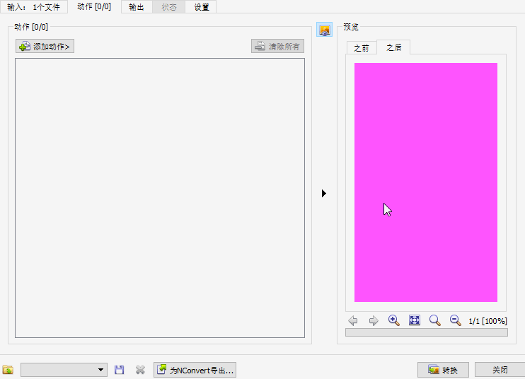

##གྲ་སྒྲིག་བྱེད་དགོས་པ་ཁག

༡ [སྙི་ཆས་ཕབ་ལེན།](https://buddhistdigitalresourcecenter.github.io/digitization-guidelines/xnviewmp/preparation/#_2)

༢ [པར་སྣོད་དང་མཁོ་སྒྲུབ་ཨང་།](https://buddhistdigitalresourcecenter.github.io/digitization-guidelines/xnviewmp/preparation/#_3)

༣ [བཤེར་པར་ངོ་བཤུས་བྱེད་ཚུལ།](https://buddhistdigitalresourcecenter.github.io/digitization-guidelines/xnviewmp/preparation/#_4)

༤ [预览 ནང་གི་ཚོན་མདོག་བརྗེ་སྟངས།](https://buddhistdigitalresourcecenter.github.io/digitization-guidelines/xnviewmp/preparation/#_5) (批量转换-设置-预览背景色-pick a screen color-选颜色-ok)

 

##༡ སྙི་ཆས་ཕབ་ལེན།

 བཤེར་པར་ཞིབ་འཇུག་གི་མགོ་གཞུག་ཀུན་ཏུ་XNView སྙི་ཆས་འདི་བཀོལ་དགོས་པས། དང་པོ་སྙི་ཆས་དེ་འདི་ནས་ཕབ་ལེན་བྱེད་དགོས། རྩིབ་ཀྱི་འདྲ་པར་འདིའི་སྟེང་ནོན་དང་XNView དྲ་རྒྱ་དང་ཐད་ཀར་མཐུད་འགྲོ། 

 

སྒེའུ་ཁུང་རྟགས་ཅན་གྱི་གློག་ཀླད་ནང་སྙི་ཆས་འདི་གཉིས་ཀྱི་འཚམ་ཤོས་དེ་ཐད་ཀར་ཕབ་ལེན་བྱེད་ཆོག

 <a href="http://download.xnview.com/XnViewMP-win.exe"><button type="button" class="btn btn-success"><i class="fa fa-cloud-download"></i> སྒེའུ་ཁུང་རྟགས་ཅན། win 32bit </button></a> <a href="http://download.xnview.com/XnViewMP-win-x64.exe"><button type="button" class="btn btn-success"><i class="fa fa-cloud-download"></i> སྒེའུ་ཁུང་རྟགས་ཅན། win 64bit </button></a>  
  

 ཀུ་ཤུ་རྟགས་ཅན་གྱི་གློག་ཀླད་ནང་འོག་གི་སྙི་ཆས་དེ་ཐད་ཀར་ཕབ་ལེན་བྱེད་ཆོག
 
 <a href="http://download.xnview.com/XnViewMP-mac.dmg"><button type="button" class="btn btn-success"><i class="fa fa-cloud-download"></i> ཀུ་ཤུ་རྟགས་ཅན། 64bit </button></a>
 
##༢ པར་སྣོད་དང་མཁོ་སྒྲུབ་ཨང་།

ཁྱེེད་ཀྱི་གློག་ཀླད་ཀྱི་Drive ཆེ་ཤོས་ནང་བཤེར་པར་ལྡུག་སའི་པར་སྣོད་ཅིག་བཟོས་ཏེ་བཤེར་པར་རྣམས་དེའི་ནང་ཕབ་བཤུས་བྱེད་དགོས། པར་སྣོད་དེའི་ཁ་ཡིག་ལ་དཔེ་ཆ་དེའི་མཁོ་སྒྲུབ་ཨང་སྤྲོད་དགོས། མཁོ་སྒྲུབ་ཨང་ནི་བཤེར་འབེབས་པས་དཔེ་ཆ་རྣམས་བཤེར་འབེབས་བྱས་ཚར་རྗེས་བརྩམས་ཆོས་སོ་སོར་གནས་སྐབས་རིང་ངོས་འཛིན་བདེ་ཕྱིར་དམིགས་བསལ་གྱི་ཨང་གྲངས་རེ་སྤྲད་པ་དེ་ལ་ཟེར། དེ་ནི་ཡིག་འབྲུ་དང་ཨང་གྲངས་
གཉིས་ཀྱིས་གྲུབ་པའི་ཡིག་འབྲུ་བདུན་གྱི་རྣམ་པ་ཅན་ཞིག་ཡིན། དཔེར་ན། ABC1234 ལྟ་བུ་ཡིན། A ནི་(Accession) མཚོན་བྱེད་དང་B ནི་འབྲེལ་མཐུད་པ་མཚོན་བྱེད། C ནི་བཤེར་འབེབས་པ་མཚོན་བྱེད་ཡིན། ཨང་གྲངས་རྣམས་དཔེ་ཆ་མཚོན་བྱེད་ཡིན་ཨང་བཞི་ལས་མ་བརྒལ་བར་གང་འདོད་དུ་བཏགས་ཆོག

པར་སྣོད་དེའི་ནང་དཔེ་ཆ་དེའི་དན་གྲངས་གོང་མ་ངེས་པར་ཡོད་དགོས། གོང་བཀོད་མཁོ་སྒྲུབ་ཨང་ཅན་གྱི་པར་སྣོད་ནང་ཡང་བསྐྱར་པར་སྣོད་ཅིག་བཟོས་ཏེ་དེའི་ཁ་ཡིག་ལ་ཡིག་ཚགས་archive ཞེས་འདོགས་དགོས། གལ་ཏེ་པོ་ཏི་དུ་མ་ཅན་གྱི་རིགས་ཡིན་ཚེ་ཡིག་ཚགས་པར་སྣོད་archive ནང་པོད་གྲངས་
དང་བསྟུན་བའི་པར་སྣོད་བཟོ་དགོས། དེ་རེ་རེའི་མིང་ལ་01- 02- 03 ལྟ་བུ་རིམ་པར་འདོགས་དགོས། མདོར་ན་པོད་རེ་ལ་པར་སྣོད་རེ་ཡོད་དགོས།

##༣ བཤེར་པར་ངོ་བཤུས་བྱེད་ཚུལ།

ཁྱེད་ཀྱི་གློག་ཀླད་ནང་ད་སྔ་བཟོས་པའི་པར་སྣོད་ནང་མཐེབ་སྡེར་དང་ཡང་ན་སྲ་སྡེར་གང་རུང་ནས་ཁྱེད་ཀྱི་བཤེར་པར་རྣམས་ཕབ་ལྡུག་བྱེད་དགོས། འོག་གི་དཔེ་རིས་དེས་ཁྱེད་ཀྱིས་ད་བར་བཟོས་པའི་མཁོ་སྒྲུབ་ཨང་ཅན་གྱི་པར་སྣོད་དང་དེའི་ནང་གསེས་ཡིག་ཚགས་པར་སྣོད་དེ་ལའང་ནང་
གསེས་པོད་གཉིས་ཅན་གྱི་པར་སྣོད། དན་གྲངས་གོང་མ། བཤེར་པར་བཅས་མཉམ་འཛོམས་བྱུང་ཡོད་པའི་རྣམ་པ་རེད།

##༤ 预览 ནང་གི་ཚོན་མདོག་བརྗེ་སྟངས།

(批量转换-设置-预览背景色-pick a screen color-选颜色-ok)

འདིའི་ནང་གི་ཚོན་མདོག་ནི་དཔེ་ཆའི་ཤོག་ངོས་དང་འཚམ་མིན་གྱི་ཁྱད་པར་ཡོད་སྟབས་འདིའི་རྒྱབ་ལྗོངས་ཚོན་མདོག་རན་པོ་ཞིག་འདེམ་རྒྱུ་གལ་ཆེན་ཡིན།

