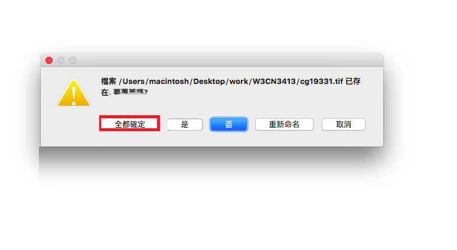
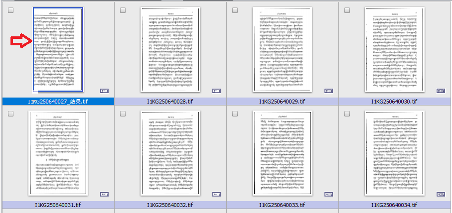
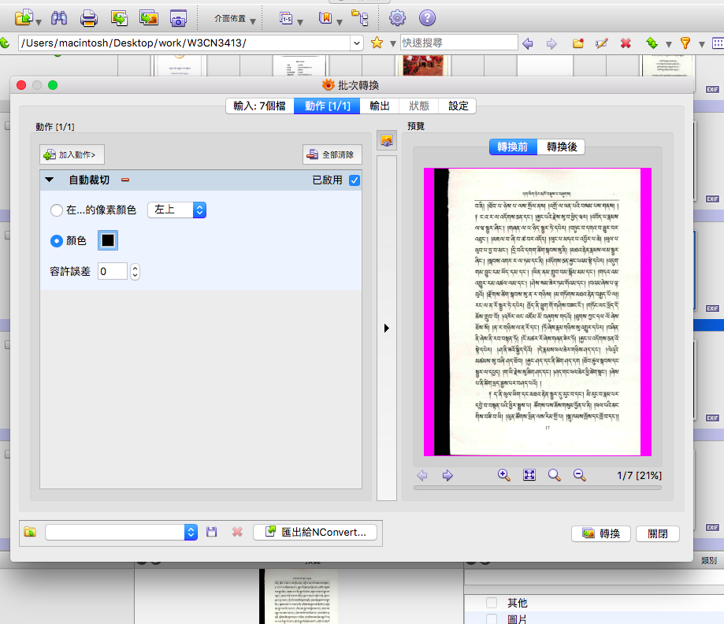
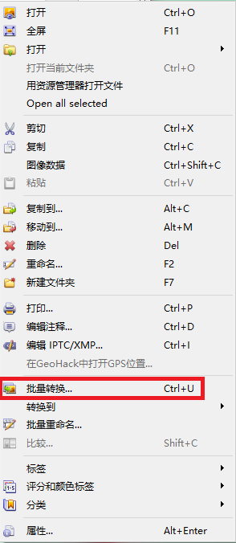

#ལས་ཀའི་གོ་རིམ་དཀར་ཆག

**ཀ. པར་སྣོད་གྲ་སྒྲིག་དང་བཤེར་པར་ཕབ་བཤུས།**	

[XNViewསྙི་ཆས་ཕབ་ལེན།](https://docs.google.com/spreadsheets/d/1LVoRacOnhttO8dZQv0dpgww754oWktDDJgXx5ET4Jlg/edit#gid=855073024)

**༡** དཔེ་ཆ་རྣམས་མཐེབ་སྡེར་དང་ཡང་སྲ་སྡེར་གང་རུང་ནས་ལེན་དགོས།

**༢** མིང་ལ་BDRC ཞེས་པའི་པར་སྣོད་ནང་གསེས་སྡེ་ཚན་གཉིས་ཏེ་བསྒྲུབ་བྱ་དང་བསྒྲུབས་ཟིན་གཉིས་ཀྱིས་གྲུབ་པའི་པར་སྣོད་ཅིག་བཟོ་དགོས།

**༣** པར་སྣོད་ནང་དཔེ་ཆ་མཉམ་དུ་BDRC གྱི་དཔེ་བྱང་ཤོག་ངོས་གཉིས་ཅན་དེ་ཡོད་མེད་ལྟ་དགོས།

**༤** དཔེ་བྱང་དེ་གཉིས་དྲ་ཐོག་ནས་ཕབ་ལེན་བྲས་ཏེ་བསྒྲུབ་བྱ་ཞེས་པའི་པར་སྣོད་ནང་བླུག་དགོས། 

**༥** གལ་ཏེ་དཔེ་བྱང་ཤོག་ངོས་གཉིས་དེ་དཔེ་ཆ་མཉམ་པོར་ཡོད་ན་དེ་བཤུས་ཏེ་(བསྒྲུབ་བྱ་)ཞེས་པའི་པར་སྣོད་ནང་བཤུས་དགོས།

**ཁ. ཤོག་གྲངས་ཞིབ་འཇུག་དང་ཉར་ཚགས་བཤེར་པར་གྲ་སྒྲིག**

**༦** (XNView) ཞེས་པའི་མཉེན་ཆས་ནང་སྒོ་ཕྱེས་ཏེ་སྡེ་ཚན་སོ་སོར་མིང་བསྐྱར་འདོགས་བྱས་རྗེས་ཤོག་ངོས་ཏག་ཏག་ཚང་ཡོད་མེད་བརྟག་དགོས།

**༧**	ཤོག་ངོས་ཆད་པའི་རིགས་ལ་ཤོག་ཚབ་སྲུབ་འཇུག་བྱེད་ཚུལ། ཤོག་ཚབ་དེའི་མིང་ལ་ཆད་པའི་ཤིག་ངོས་གོང་མ་ཀ་བ་ཞིག་བཟོས་དགོས།

**༨**	BDRC དཔེ་བྱང་ཤོག་ངོས་གཉིས་ཅན་དེ་དང་དཔེ་ཆའི་རྒྱབ་ཤ་བཅས་དཔེ་ཆའི་དབུ་རུ་ཡོད་མེད་བལྟ་དགོས།

**༩**	BDRC གྱི་དཔེ་བྱང་ལྟར་བཤེར་པར་ཡོངས་ཀྱི་མཚན་བྱང་གཅིག་གྱུར་དང་བསྐྱར་འདོགས་བྱེད་དགོས།

**༡༠**	བཤེར་པར་རྣམས་ཀྱི་ཡོ་འཁྱོག་བསྲིང་དགོས་མིན་དང་ཡིག་འབྲུ་བཅད་གཏུབ་ཤོར་ཡོད་མེད་ལེགས་པར་བརྟག་དགོས།

**༡༡**	ནོར་འཁྲུལ་ཤོར་ཡོད་སའི་ཤོག་ངོས་ཁག་གི་ཨང་གྲངས་དང་མིང་ནོར་འཁྲུལ་ཟིན་ཐོ་ "Issues" spreadsheet ནང་འགོད་དགོས།

**༡༢**	བཤེར་པར་ཁག་གི་ཤོག་མཐའི་གྲིབ་ནག་ XNView མཉེན་ཆས་ཀྱི་སྡེ་ཚན་(动作) ནང་ནས་གཏུབ་སྒྲིག་བྱེད་དགོས།

**༡༣**	(Image) པར་སྣོད་འདི་ངོ་བཤུས་གཅིག་བྱས་ཏེ་དེའི་མིང་ཉར་ཚགས་པར་སྣོད་ (archive) ཅེས་འདོགས་དགོས།

**ག. དྲ་སྤེལ་བཤེར་པར་གྲ་སྒྲིག	**

**༡༤**	དེ་ནས་(Image) འདིའི་པར་རྣམས་པར་སྐྱ་ B&W རིགས་ལ་བསྒྱུར་དགོས།

**༡༥**	གལ་ཏེ་པར་གྱི་གསལ་ཆ་༤༠༠ ལས་བརྒལ་ཡོད་ན་dpi གྱི་ཆེ་ཆུང་༤༠༠ དང་ཡང་ན་དེ་ལས་ཆུང་བར་བསྒྱུར་དགོས།

**༡༦**	ཚོན་ལྡན་འདྲ་པར་ཁག་JPEG རིགས་ལ་བསྒྱུར་དགོས།

**༡༧**	ཚོན་ལྡན་འདྲ་པར་ཁག་གི་ཞེང་ཁ་ཆེ་ཆུང་མི་སྙོམ་ཚེ་དེའི་ཆེ་ཆུང་གཞན་དང་མཐུན་པར་སྙོམ་དགོས།

**༡༨**	JPEG རིགས་ཀྱི་བཤེར་པར་ཁག་གི་ཆེ་ཆུང་KB ༤༠༠ ལས་བརྒལ་ཡོད་ཚེ་ཆེ་ཆུང་༤༠༠ ཏག་ཏག་ལ་བཅོས་དགོས།

**ང. བཤེར་པར་ཉར་ཚགས།**

**༡༩**	དེ་དག་ལེགས་པར་བསྒྲུབ་རྗེས་དཔེ་ཆ་དེ་གོང་ན་ཡོད་པའི་བསྒྲུབས་ཟིན་ཞེས་པའི་པར་སྣོད་ནང་ལྡུག་དགོས།
**༢༠**	བསྒྲུབ་ཟིན་པའི་དཔེ་ཆའི་མཚན་བྱང་ཐོ་དེབ་ནང་འགོད་དགོས།

##གྲ་སྒྲིག  XNView སྙི་ཆས་ཕབ་ལེན། 

དང་པོ། ཁྱེད་ཀྱིས་གྲ་སྒྲིག་བྱེད་དགོས་པ་ནི་xnView MP ཞེས་པའི་མཉེན་ཆས་འདི་ནས་ཕབ་ལེན་བྱེད་རྒྱུ་དེ་རེད། གློག་ཀླད་རིགས་གང་ཡིན་ལ་ལྟོས་ཏེ་འདི་ནས་ཕབ་ལེན་བྱེད་ཆོག

[http://www.xnview.com/en/xnviewmp/](http://www.xnview.com/en/xnviewmp/) #downloads [install:](http://www.xnview.com/en/xnviewmp/#downloads)

## ཀ. ༡ མཐེབ་སྡེར་ནས་དཔེ་ཆ་ལེན་པ།	

འདི་ནི་ཁྱེད་ཀྱི་མཐེབ་སྡེར་དང་ཡང་ན་སྲ་སྡེར་གང་རུང་ནང་གི་དཔེ་ཆ་ཁག་ཚུར་ཁྱེད་ཀྱི་གློག་ཀླད་ནང་བླངས་ཡོད་པའི་རྣམ་པ་རེད།

༢. ཁྱེད་ཀྱི་གློག་ཀླད་ཀྱི་Drive ནང་གི་ཤོང་ཚད་ཆེ་ཤོས་དེའི་ནང་པར་སྣོད་ཅིག་བཟོས་རྗེས། དཔེ་ཆ་རྣམས་དེའི་ནང་ཕབ་ལེན་བྱེད་དགོས། 

༣. xnViewMP བཤེར་པར་རྣམས་མཉེན་ཆས་འདིའི་ནང་སྒོ་འབྱེད་བྱོས།

##༢ BDRC གྱི་པར་སྣོད་ཅིག་བཟོ་དགོས།

འདིར་དང་པོ། BDRC ཞེས་པའི་པར་སྣོད་གཙོ་བོ་གཅིག་ལ་ནང་གསེས་པར་སྣོད་གཉིས་ཏེ་བསྒྲུབ་བྱའི་དཔེ་ཆ་ཁག་བླུག་ས་ཞིག་དང་བསྒྲུབས་ཟིན་བའི་དཔེ་ཆ་ཁག་ལྡུག་སའི་པར་སྣོད་གཅིག་བཅས་བཟོ་དགོས། དཔེར་ན། ཨིན་ཡིག་ནང་ Done དང་ To Do གཤམ་གྱི་དཔེ་རིས་ནང་གསལ་བཞིན། 

##༣ དཔེ་བྱང་ཡོད་མེད་ལྟ་དགོས།

ཁྱེད་ཀྱིས་ཕབ་ལེན་བྱས་པའི་དཔེ་ཆ་དེའི་ནང་BDRC གྱི་དཔེ་བྱང་ཤོག་ངོས་གཉིས་ཅན་དེ་དཔེ་ཆ་མཉམ་དུ་ཡོད་མེད་བལྟ་དགོས། མེད་ཚེ་དྲ་ཚིགས་འདི་ནས་ཕབ་ལེན་བྱེད་དགོས། འོན་ཀྱང་། འདིར་དཔེ་ཆ་འདིའི་ནང་དཔེ་བྱང་ཤོག་ངོས་གཉིས་དེ་དཔེ་ཆ་མཉམ་བོར་ཡོད་པའི་རྣམ་པ་རེད།

##༤ དཔེ་བྱང་ཕབ་ལེན། 

གལ་ཏེ་དཔེ་བྱང་ཤོག་ངོས་གཉིས་ཅན་དེ་དཔེ་ཆ་མཉམ་བོར་མེད་ཚེ་དྲ་ཚིགས་འདི་ནས་ [www.tbrc.org/scan-requests/](http://www.tbrc.org/scan-requests/) ཕབ་ལེན་བྱོས། ཕབ་ལེན་བྱས་རྗེས་གཤམ་གྱི་དཔེ་རིས་དེ་འཆར་ཡོང་། གཤམ་གྱི་དཔེ་རིས་ངོས་སུ་གསལ་བ་བཞིན་སྒེའི་ཁུང་ཅན་གྱི་གློག་ཀླད་རིགས་ལ་མཐེབ་གཞུང་སྒང་གི CTRL+F ཡང་ན་ ཀུ་ཤུ་རྟགས་ཅན་ལ་command+F ནོན་དང་འཚོལ་སྒམ་དེ་འཆར་ཡོང་། དེའི་རྗེས་ཁྱེད་ཀྱི་དཔེ་ཆ་དེའི་མཁོ་སྒྲུབ་ཨང་ཕབ་བཤུས་བྱས་ཏེ་སྒམ་ཆུང་དེའི་ནང་བླུགས་དང་ ཐད་ཀར་དཔེ་ཆ་དེའི་མཁོ་སྒྲུབ་ཨང་ལི་ཁྲིའི་ཚོན་མདོག་ནང་སྟོན་ཡོང་། འཆར་མི་ཐུབ་ཚེ་ཨང་གྲངས་ནོར་སོང་བ་དང་ཡང་ན་ད་དུང་དྲ་འགོད་མ་བྱས་པ་གང་རུང་ཡིན་སྲིད།

༡. དཔེ་བྱང་པར་སྣོད་དེ་ཕབ་ལེན་བྱས་རྗེས་ 解压缩 འདིའི་སྟེང་ནོན་དང་སྒོ་ལྕགས་འབྱེད་ཡོང་། དེ་ཡང་ཕབ་ལེན་བྱེད་སྟངས་ཡང་གཤམ་གསལ་བཞིན་ཨང་རིམ་ལྟར་གནོན་དགོས། དེ་བཤུས་ཏེ་ལས་བཞིན་བའི་པར་སྣོད་ནང་བླུགས། 

གཤམ་གྱི་དཔེ་རིས་ནི་ད་ལྟ་ཁྱེད་ཀྱིས་ཕབ་ལེན་བྱས་པའི་དཔེ་བྱང་དེ་པར་སྣོད་ནང་དངོས་སུ་སླེབས་ཡོད་པའི་རྣམ་པ་རེད། 

འདི་ནི་དཔེ་བྱང་གི་པར་སྣོད་དེ་ཕབ་བཤུས་བྱས་ཏེ་(བསྒྲུབ་བྱ) ཞེས་པའི་པར་སྣོད་ནང་བླུགས་ཡོད་པའི་རྣམ་པ་རེད། 

##༥ དཔེ་བྱང་པར་སྣོད་ནང་ལྡུག་དགོས།

འདི་ནི་ཁྱེད་ཀྱི་མཐེབ་སྡེར་ནང་གིབཤེར་་པར་རྣམས་བཤུས་ཏེ་ད་སྔའི་དཔེ་བྱང་པར་སྣོད་བསྒྲུབ་བྱ་ཟེར་བའི་ནང་ལྡུག་བཞིན་བའི་རྣམ་པ་རེད། གཤམ་གྱི་དཔེ་རིས་ནང་གསལ་བཞིན།

འདི་ནི་དཔེ་བྱང་དང་བཤེར་པར་རྣམས་པར་སྣོད་གཅིག་གི་ནང་མཉམ་འཛོམས་བྱུང་ཡོད་པའི་དཔེ་རིས་རེད། 

#ཁ. ཤོག་གྲངས་དང་ཉར་ཚཊ་བཤེར་པར།

##༦ མིང་བསྐྱར་འདོཊ་དང་ཤོག་ངོས་ཚང་མིན།

༡. འཆར་སྟོན། འདི་ནི་བཤེར་པར་རྣམས་XNView MP མཉེན་ཆས་ནང་འཆར་སྟོན་གྱི་རྣམ་པ་གང་འདྲ་དགོས་མིན་འདི་ནས་འདེམས་སྒྲིག་བྱེད་དགོས། དཔེར་ན། བཤེར་པར་ཁག་གི་གནས་ཚུལ་རྒྱས་བསྡུས་ག་ཚོད་ཙམ་པར་གྱི་གཤམ་ལ་སྟོན་དགོས་མིན་དང་། པར་རེ་རེའི་བར་ཐག་གི་ཚད་སོགས་འདི་ནས་འདེམས་སྒྲིག་བྱེད་ཆོག་པ་ཡིན། མིང་འདོགས་ཚུལ་གྱི་ངོ་སྤྲོད་ཞིབ་ཕྲ་གཤམ་གྱི་སྡེ་ཚན་དགུ་བའི་ནང་ཡོད་པས་དེར་གཟིགས་རོགས།

##༧ ཤོག་ཚབ་སྲུབ་འཇུག་བྱེད་ཚུལ།

འདིར་ཤོག་ངོས་ ༥ པ་བཤེར་འབེབས་སྐབས་ཆད་ཡོད་སྟབས། དཔེ་ཆའི་མགོ་གཞུག་གང་རུང་ཞིག་ནས་ཤོག་སྟོང་ཞིག་ཕབ་བཤུས་བྱས་ཏེ་ཤོག་གྲངས་ལྔ་བའི་ཚབ་ལ་ཤོག་ངོས་བཞི་བ་ཀ་བ་ཞིག་བཟོས་ཡོད་པའི་རྣམ་པ་རེད། རྒྱུ་མཚན་དཔེ་ཆའི་ཤོག་གྲངས་ཚང་མིན་ཞིབ་འཇུག་སྟབས་བདེ་ཁོ་ནའི་ཆེད་ཡིན། འོན་ཀྱང་། ཤོག་ངོས་ཆད་པ་དེ་ཐོ་དེབ་ནང་ངེས་པར་འགོད་དགོས། 

 

##༨ དཔེ་བྱང་དང་དཔེ་ཆའི་རྒྱབ་ཤ།

 དཔེ་ཆ་རེ་རེའི་ནང་དཔེ་ཆ་མཉམ་བོར་དཔེ་བྱང་དང་དཔེ་ཆའི་རྒྱབ་ཤ་རྒྱབ་མདུན་གཉིས་ཆ་ཡོད་དགོས། འདི་ནི་དཔེ་བྱང་ཤོག་ངོས་གཉིས་ཅན་དེ་དང་རྒྱབ་ཤའི་མདུན་ངོས་བཅས་པ་དཔེ་ཆའི་དབུ་རུ་ཡོད་པའི་རྣམ་པ་རེད། རྒྱབ་ཤའི་རྒྱབ་ངོས་དེ་བཤེར་པར་ཡོངས་ལ་གཅིག་མཚུངས་ཀྱིས་དཔེ་ཆའི་མཇུག་ལ་ཡོད་དགོས། འོན་ཀྱང་། དཔེ་ཆ་འདིའི་ནང་དཔེ་བྱང་ཤོག་ངོས་གཉིས་ཅན་དེ་དཔེ་ཆའི་དབུ་རུ་སླེབས་ཡོད་པའི་རྣམ་པ་རེད།

##༩ མིང་གཅིག་གྱུར་དང་བསྐྱར་འདོཊ།

གཤམ་གྱི་དཔེ་རིས་ངོས་སུ་གསལ་བ་བཞིན་བཤེར་པར་རྣམས་འདི་ལྟར་སྒོ་འབྱེད་བྱས་རྗེས་དང་པོ་དབུ་ཤོག་ནས་དཀར་ཆག་ལ་ཐུག་གི་བར་སྡེ་ཚན་གཅིག་བྱས་ཏེ་དེའི་མིང་ལ་ a#### བཏགས་ན་དབུ་ཤོག་ནས་དཀར་ཆག་ཤོག་ངོས་ཐུག་གི་བར་ཤོག་ངོས་A1 ནས་a8 བར་ཨང་རིམ་རང་འགུལ་གྱིས་སླེབ་ཡོང་། དེ་ནས་དཀར་ཆག་ཤོག་ངོས་ནས་གཞུང་གི་དངོས་གཞིའི་བར་སྡེ་ཚན་ b#### ཞེས་མིང་བཏགས་ན་དཀར་ཆག་སྡེ་ཚན་གྱི་ཤོག་ངོས་དང་པོ་B1ནས་b8བར་སྡེ་ཚན་གཅིག་དང་ད་ལྟ་བཏགས་པའི་ཨང་གྲངས་དང་ཤོག་ངོས་རང་གི་ཤོག་གྲངས་གཉིས་ཆ་གཅིག་གྱུར་ཆགས་ཡོད་པས། ཤོག་གྲངས་ཚང་མིན་ཞིབ་འཇུག་བྱེད་པར་ཧ་ཅང་སྟབས་བདེ་བའི་ཁྱད་ཆོས་ཡོད། དཔེར་ན། དཔེ་ཆ་རང་གི་ཤོག་གྲངས་དང་ད་ལྟ་རང་བཏགས་པའི་སྡེ་ཚན་སོ་སོའི་ཤོག་གྲངས་གཉིས་གཅིག་མཚུངས་ཡིན་སྟབས་དེ་གཉིས་གཤུབ་བསྡུར་བྱས་ཏེ་མཚུངས་མིན་བལྟས་པ་ཙམ་གྱིས་ཞིབ་འཇུག་དང་ངོས་འཛིན་བྱེད་སླ་བ་ཡིན། 

གཤམ་གྱི་དཔེ་རིས་ནི་དཔེ་པར་གྱི་མིང་འགྱུར་བ་གཏོང་སའི་གོ་རིམ་སྟོན་བའི་དཔེ་རིས་རེད།

ད་སྔའི་དཔེ་ཆ་དེའི་བཟོ་བཅོས་ལེགས་པར་གྲུབ་རྗེས་ 输出: ནས་དཔེ་ཆ་དེའི་ཤོག་ངོས་ཡོད་དོ་ཅོག་གི་མཚན་བྱང་གཅིག་གྱུར་རམ་མིང་བསྐྱར་འདོགས་བྱེད་བཞིན་པའི་རྣམ་པ་རེད། དང་པོ། དཔེ་ཆ་དེའི་མཁོ་སྒྲུབ་ཨང་གྲངས་དངོས་ཕབ་བཤུས་བྱས་ཏེ་འདིར་བླུགས་རྗེས།
འོག་ལ་བཀོད་པའི་རྟགས་དེ་བཞི་དང་ཡང་ན་ལྔ་དཔེ་ཆའི་ཤོག་གྲངས་མང་ཉུང་ལ་ལྟོས་ཏེ་འགོད་དགོས། གཉིས་པ། དེའི་གཤམ་གྱི་དམར་རྟགས་དེའི་དང་པོ་དཔེ་ཆ་དེའི་མཚན་བྱང་རྙིང་བ་དང་། གཉིས་པ་ད་ལྟ་འགོད་བཞིན་བའི་མཚན་བྱང་གསར་བ་རེད། འདི་དག་ཡོངས་ལ་
ཞིབ་བརྟག་རྗེས། ok ཐོག་ནོན་དང་དཔེ་པར་གྱི་མིང་ཡོངས་གཅིག་གྱུར་བཟོ་འགྲོ།

འགྲིག་རྟགས་བཀོད་རྗེས། གཤམ་གྱི་དཔེ་རིས་ཆུང་བ་དེ་འཆར་ཡོང་། འགྱུར་བ་ཆ་ཚང་གཏོང་གི་ཡིན་ཞེས་པ་དེར་བསྣུན་ན་དངོས་སུ་འགྱུར་བ་གཏོང་འགྲོ།

གཤམ་གྱི་དཔེ་རིས་ནི་འགྱུར་བ་གཏོང་བཞིན་བའི་ཡུལ་དངོས་ཀྱི་རྣམ་པ་རེད།

##༡༠ ཡོ་འཁྱོག་དང་བཅད་གཏུབ་ཡོད་མེད།

བཤེར་པར་རྣམས་ཡོ་འཁྱོག་དང་ཡིག་འབྲུ་བཅད་གཏུབ་ཤོར་ཡོད་མེད་ཞིབ་འཇུག་བྱེད་དགོས། འདི་ནས་བཤེར་པར་ཁག་གི་ཤོག་ངོས་རེ་རེའི་སྟེང་ནོན་དང་དེ་དག་ཡོ་འཁྱོག་སོང་ཡོད་མེད་དང་རྣམ་སྒྲིག་གང་ཡིན། ཆེ་ཆུང་བཅས་ལ་ཞིབ་ལྟ་བྱེད་ཐུབ་པ་ཡིན།

དོ་སྣང་བྱེད་དགོས་པ་ཞིག་ནི་དཔེ་པར་ཞིབ་འཇུག་སྐབས་སུ་བཤེར་པར་མགོ་བཞུག་ལོག་པ་དང་ཡོ་འཁྱོག་ཡོད་མེད་ལ་དོ་སྣང་བྱེད་དགོས་བཞིན། དཔེར་ན། གཤམ་གྱི་བཤེར་པར་ནང་དམར་རྟགས་བཀོད་ཡོད་སའི་ཤོག་ངོས་ལྟ་བུ་འཕྲེད་ཉལ་རིགས་ཡོད་ཚེ། མཉེན་ཆས་འདིའི་ཀླད་ཀྱི་གཡོན་ཕྱོགས་སུ་
ཡོད་པའི་ཡོ་བསྲང་བཀོལ་ཏེ་ཐད་ཀར་བསྲང་ཆོག འོན་ཀྱང་། བསེག་པ་དང་ཡོ་འཁྱོག་རིགས་བྱུང་ཚེ། 批量转换མཉེན་ཆས་འདི་སྤྱད་དེ་ཡོ་བསྲང་བྱེད་དགོས།

གཉིས་པ། བཤེར་པར་འགའ་རེ་བཤེར་འབེབས་བྱེད་སྐབས་བཅད་གཏུབ་ཤོར་ཏེ་ཤོག་ངོས་ཀྱི་ཡིག་འབྲི་ཀློག་མི་ཐུབ་པའི་རིགས་བྱུང་ཡོད་ཚེ་གོང་ཞུས་ལྟར་ནོར་འཁྲུལ་ཐོ་དེབ་ནང་དཔེ་ཆའི་མིང་དང་ཤོག་གྲངས་བཅས་ཁ་གསལ་འགོད་དགོས། དཔེར་ན། གཤམ་གྱི་དཔེ་རིས་ངོས་ཀྱི་དམར་རྟགས་བཀོད་
པའི་ཤོག་ངོས་བཞིན།

##༡༡ ནོར་འཁྲུལ་ཐོ་འགོད།

འདིར་དཔེ་ཆ་དང་འབྲེལ་བའི་ནོར་འཁྲུལ་ཡོད་དོ་ཅོག་ང་ཚོའི་ནོར་འཁྲུལ་ཐོ་དེབ་ Issues/ spreadsheet ནང་ནོར་འཁྲུལ་ཡོད་སའི་དཔེ་ཆའི་མིང་དང་ཨང་གྲངས། ཤོག་གྲངས། བཤེར་པར་གྱི་གསལ་ཆ་ཆུང་དྲག་པས་པར་གསལ་བོ་མེད་པ། ཤོག་ངོས་གཉིས་རེ་པར་ངོས་གཅིག་
གི་ནང་ཡོད་པ་ལྟ་བུ། ཁ་གསལ་ཞིག་ངེས་པར་འགོད་དགོས། དཔེར་ན། གཤམ་གྱི་ཤོག་ངོས་ལྔ་བ་ཆད་ཡོད་སྟབས་ཤོག་སྟོང་ལྷག་མ་ཞིག་དེའི་ཚབ་ལ་སྲུབ་འཇུག་བྱས་ཡོད་པ་རེད། 

##༡༢ གྲིབ་ནག་གཏུབ་སྟངས། 

བཤེར་པར་གྱི་མཐའ་རྣམས་ལ་ཚོན་མདོག་མི་འདྲ་བའི་གྲིབ་ནག་ལྟ་བུ་ཡོད་ན་XNView སྙི་ཆས་སྤྱད་དེ་དཔེ་ཆའི་ཡིག་འབྲུ་ལ་མི་གནོད་པའི་ཐོག་ནས་བཅོས་སྒྲིག་བྱེད་དགོས། 

བཤེར་པར་གྱི་མཐའི་གྲིབ་ནག་མ་གཏུབ་པའི་སྔོན་ལ་དཔེ་ཆའི་ཡིག་འབྲུ་ལ་གནོད་སྐྱོན་ཤོར་ཡོད་མེད་བརྟག་དགོས། གལ་ཏེ་ཡིག་འབྲུ་ལ་སྐྱོན་ཤོར་ཡོད་ན་དཔེ་ཆའི་མིང་དང་ཤོག་གྲངས་ཐོ་འགོད་བྱེད་དགོས། ཤོག་མཐའི་གྲིབ་ནག་གཏུབ་སྟངས་ནི།  གལ་ཏེ་ཤོག་མཐའི་གྲིབ་ནག་ཆེན་པོ་
རིགས་ཡོད་ཚེ་ངེས་པར་གཏུབ་དགོས་ཏེ། དང་པོ། ཤོག་མཐའི་གྲུབ་ནག་གི་ཆེ་ཆུང་གཅིག་ལ་ཕྱོགས་ཡང་གཅིག་པའི་བཤེར་པར་ཁག་སྡེབ་གཅིག་ལ་བདམས་ཏེ་བཟོ་བཅོས་བྱེད་ཆོག དཔེར་ན། གྲིབ་ནག་བཤེར་པར་གྱི་གཡོན་ཕྱོགས་སུ་ཡོད་པའི་ཤོག་ངོས་ཁག་སྡེབ་གཅིག་ལ་གདམ་རྗེས།

མདའ་རྩེ་དེ་ཁྱེད་ཀྱིས་བདམས་པའི་བཤེར་པར་ཁག་གི་སྟེང་བཞག་སྟེ་ཙི་ཙི་གཡས་གནོན་བྱོས་དང་གཤམ་གྱི་དཔེ་རིས་ངོས་སུ་གསལ་བ་བཞིན་དེའི་དཀར་ཆག་སྟེགས་བུ་ཞིག་འཆར་ཡོང་། དེའི་ནང་གི་དམར་རྟགས་བཀོད་ཡོད་ས་དེར་ནོན་དང་དེའི་སྒྲིག་འགོད་མ་ལག་དངོས་སུ་འཆར་ཡོང་བ་
ཡིན། མྱུར་ལམ། སྒེའི་ཁུང་ཅན་གྱི་གློག་ཀླད་རིགས་ལ་མཐེབ་གཞུང་སྒང་གི་ ctrl+u ཡང་ན་ཀུ་ཤུ་རྟགས་ཅན་གློག་ཀླད་རིགས་ལ command-u གནོན་དགོས།

འདི་ནི་ 输入: སྟེ་གཤམ་གྱི་སྡེ་ཚན་དེའི་སྒྲིག་འགོད་དང་པོ་དེའི་ནང་ཁྱེད་ཀྱིས་བདམས་པའི་བཤེར་པར་ཁག་སླེབས་ཡོད་པའི་རྣམ་པ་རེད།

གཤམ་གྱི་དཔེ་རིས་ནི་སྒྲིག་འགོད་སྟེགས་བུའི་རྒྱབ་ལྗོངས་ཚོན་མདོགས་བརྗེ་བསྒྱུར་ཇི་ལྟར་བྱེད་དགོས་པའི་ལམ་སྟོན་དཔེ་རིས་ཡིན། ༡. 设定 ༢. ཚོན་མདོག་གྲུ་བཞིའི་སྟེང་ནོན། ༣. འདེམས་དགོས་པའི་ཚོན་མདོག་གང་རུང་ཞིག་གི་སྟེང་ནོན། ༤. Ok སྟེང་ནོན་དང་འགྲིག་པ་ཡིན།

འདི་ནི་སྒྲིག་འགོད་གཉིས་པ་ 动作: ཞེས་པའི་མ་ལག་ནང་བཤེར་པར་ཁག་གི་མཐའི་གྲིབ་ནག་ལ་བཟོ་བཅོས་བྱེད་བཞིན་བའི་རྣམ་པ་རེད། དང་པོ། 添加动作 གྱི་སྟེང་བསྣུན་ན་དེའི་ནང་གསེས་སྡེ་ཚན་གྱི་ལག་ཆ་རང་འགུལ་གཏུབ་གྲི་ 自动裁剪 ཟེར་བ་དེ་འདེམས་དགོས། ད་གཟོད་ཤོག་མཐའི་གྲིབ་ནག་དེ་གཏུབ་འགོ་བརྩམ་ཆོག གལ་ཏེ་རང་འགུལ་གཏུབ་གྲིས་རང་འགུལ་གྱིས་གཏུད་མི་ཐུབ་ན། ལག་ཆ་གཞན་གཏུབ་གྲི་ 裁剪 ཞེས་པ་དེ་འདེམས་ཏེ་གཏུབ་དགོས། རྒྱུ་མཚན་གྲིབ་ནག་དེའི་མཐའ་ལའང་ཧ་ཅང་ཕྲ་བའི་ཚོན་མདོག་གཞན་མང་བོ་ཡོད་སྟབས། དང་པོ་ཚོན་མདོག་དེ་དག་རང་གིས་གཏུབ་དགོས་པ་ཡིན།

གཤམ་གྱི་དཔེ་རིས་ནི་གོང་གི་གཏུབ་གྲི་ 裁剪 ཞེས་པ་དེ་ཇི་ལྟར་འདེམས་དགོས་པའི་ལམ་སྟོན་དཔེ་རིས་ཡིན། 

གཤམ་གྱི་དཔེ་རིས་ནི་གོང་གི་རང་འགུལ་གཏུབ་གྲི་ 自动裁剪 བཀོལ་སྤྱོད་བྱེད་སྐབས་ཤོག་མཐའི་གྲིབ་ནག་ཇི་ལྟར་འདེམས་དགོས་པའི་ལམ་སྟོན་དཔེ་རིས་ཡིན། ཨང་རྟགས་བཀོད་པའི་གོ་རིམ་ལྟར་བསྣུན་པ་ཙམ་གྱིས་ཆོག འོན་ཀྱང་། གསུམ་པ་མདའ་རྩེས་མཐའ་དེའི་གྲིབ་ནག་དེ་འདེམ་དགོས།

བཟོ་བཅོས་བཏང་བ་དེ་འགྲིག་མིན་རྟོག་དཔྱོད་བྱེད་དགོས། གཏུབ་པ་འགྲིག་ཡོད་ན་ཤོག་མཐའི་གྲིབ་ནག་ཇེ་ཆུང་དང་། གལ་ཏེ་གཏུབ་པ་འགྲིག་མེད་ན་་添加动作 ཞེས་པ་ནས་གཏུབ་གྲི་ 裁剪ཞེས་པ་དེ་འདེམས་ཏེ་ཤོག་མཐའི་གྲིབ་ནག་གི་མཐའ་ན་
ཡང་ཚོན་མདོག་ཕྲ་བོ་ཧ་ཅང་མང་པོ་ལྷག་ཡོད་པས་དེ་དག་གཏུབ་ན། ད་གཟོད་རང་འགུལ་གཏུབ་གྲིའི་ལས་ཀ་ཏག་ཏག་བྱེད་ཐུབ་པ་ཡིན། 

དེ་ནས་ཕྱོགས་བཞིའི་མཐའ་གང་གི་ཚོན་མདོག་གཏུབ་དགོས་མིན་དེ་འོག་གི་སྒྲིག་སྒམ་ནས་འདེམས་སྒྲིག་བྱེད་དགོས། གལ་ཏེ་ཕྱོགས་གཡས་གཡོན་གཉིས་ལ་གྲིབ་ནག་ཡོད་ཚེ་10་རེ་དང་ཡང་ན་5རེ་བཞག་ན་ཤོག་ངོས་གཡས་གཡོན་གཉིས་སུ་ཡོད་པའི་གྲིབ་ནག་རྣམས་རང་འགུལ་གཏུབ་གྲིས་སྡེབ་གཅིག་ལ་གཏུབ་འགྲོ འོན་ཀྱང་། ཨང་གྲངས་ག་ཚོད་ཀྱིས་གཏུབ་དགོས་མིན་རང་གིས་འདེམས་སྒྲིག་བྱེད་དགོས། 

ད་དུང་ཁྱེད་ཀྱིས་པར་མཐའི་ཚོན་མདོག་ཡོངས་རྫོགས་གཙང་བཟོ་བྱེད་མི་ཐུབ་ཚེ། གོང་ཞུས་ལྟར་གཏུབ་གྲི་ 裁剪 འདི་བཀོལ་སྤྱོད་བྱེད་དགོས། སྤྱོད་ཚུལ་སྔོན་སོང་ལྟར་ཡིན། 

གཤམ་གྱི་དཔེ་རིས་ནི་ཨིན་ཡིག་ནང་ 公差ཞེས་པའི་ཨང་གྲངས་སྣོན་འཕྲི་བྱས་ན་གྲིབ་ནག་ག་ཚོད་གཏུབ་དགོས་མིན་ཚོད་འཛིན་བྱེད་ཐུབ་པ་ཡིན། གྲིབ་ནག་ག་ཚོད་གཏུབ་དགོས་མིན་ལ་ལྟོས་ཏེ་ཨང་གྲངས་འདི་སྒྲིག་སྦྱོར་བྱེད་དགོས། 

གཤམ་གྱི་དཔེ་རིས་དེའི་ཀླད་ཀྱི་དམར་ཐིག་བཀོད་ཡོད་སའི་སྔ་མ་དང་གཞུག་མ་ 之前、之后ཞེས་པས་གྲིབ་ནག་བཅད་གཏུབ་ཀྱི་སྔ་རྗེས་གཉིས་སུ་འགྱུར་བ་ཇི་ལྟར་སོང་ཡོད་མེད་རྟོག་བྱེད་ཡིན། གཤམ་གྱི་མདའ་གཡས་གཡོན་གཉིས་ལ་བསྟན་པ་དེར་བསྣུན་ན་
སྒམ་དེའི་ནང་ནང་འདྲེན་བྱས་པའི་དཔེ་པར་ཁག་ལ་རིམ་པར་ཞིབ་འཇུག་བྱེད་ཐུབ་པ་ཡིན། 

##༡༣ པར་སྣོད་ཀྱི་མིང་བརྗེ་བསྒྱུར།

ད་ལྟ་ཁྱེད་ཀྱིས་དག་སྒྲིག་བྱས་ཟིན་བའི་ཨིན་ཡིག་ནང་image ཞེས་པ་གྲུབ་རྗེས་པར་སྣོད་འདི་ཕབ་བཤུས་བྱས་ཏེ་པར་སྣོད་དེའི་མིང་ལ་ཉར་ཚགས་སམ་ཡིག་ཚགས་པར་སྣོད་ཨིན་ཡིག་ནང་ archive ཅེས་འདོགས་དགོས། གཤམ་གྱི་དཔེ་རིས་ལ་གཟིགས།

ད་ནི་ཉར་ཚགས་ཀྱི་པར་སྣོད་གྲུབ་པ་ཡིན། 

# ག. དྲ་སྤེལ་བཤེར་པར་གྲ་སྒྲིག		

##༡༤ སྐྱ་པར་བཟོ་སྒྲིག།

ཚོན་ལྡན་འདྲ་པར་ཁག་དང་དཔེ་ཆའི་རྒྱབ་ཤ་རྒྱབ་མདུན་གཉིས་ཕུད་པའི་བཤེར་པར་རྣམས་ཀྱི་ dpi ༦༠༠ ཡིན་ན་དེའི་dpi ༣༠༠ དང་ཡང་ན་དེ་ལས་ཆུང་བར་བསྒྱུར་དགོས། བསྒྱུར་སྟངས་འོག་གི་དཔེ་རིས་ལ་གཟིགས།

ཚོན་ལྡན་དཔེ་ཆའི་རྒྱབ་ཤ་རྒྱབ་མདུན་གཉིས་དང་འདྲ་པར་ཁག་ཕུད་པའི་བཤེར་པར་རྣམས་ jpeg རིགས་ཡིན་ན་དེ་རྣམས་ངེས་པར་སྐྱ་པར་ tiff g4 ལ་བསྒྱུར་དགོས། སྤྱིར་བཤེར་པར་དེ་དག་བསྒྱུར་དུས་ 动作 ནང་གི་ལག་ཆ་མེད་པར་བཟོ་དགོས་མོད། སྐབས་འདིར་ 批量转换 མཉེན་ཆས་དང་དེའི་ནང་གི་动作 དང་དེ་ནས་改变颜色深度 ཟེར་བ་དེ་འདེམས་དགོས།

གཤམ་གྱི་དཔེ་རིས་ནི་ 改变颜色深度 ནང་གི་གདམ་གསེས་ཇི་ལྟར་བྱེད་དགོས་པའི་ལམ་སྟོན་དཔེ་རིས་རེད། ཨང་རིམ་གྱིས་འདེམས་གནོན་བྱས་རྗེས། 输出 ནང་ནས་དངོས་སུ་བསྒྱུར་དགོས་པ་ཡིན།

འདི་ནི་ 动作 ནང་གི་སྒྲིག་འགོད་ཟིན་རྗེས་ 输出 ནང་ནས་དཔེ་པར་རྣམས་ CCiTT G4 ཇི་ལྟར་བསྒྱུར་དགོས་པའི་ལམ་སྟོན་དཔེ་རིས་ཡིན། འདེམས་སྟངས་ཨང་རིམ་ལྟར་བསྣུན་པས་ཆོག

##༡༥ གསལ་ཆ་ཆུང་རུ་གཏོང་སྟངས།

ཨང་གྲངས་ ༣༠༠ བྲིས་རྗེས་ 输出 ནས་བསྒྱུར་དགོས་པ་ཡིན།

##༡༦ ཚོན་ལྡན་jpeg ལ་བསྒྱུར་དགོས།

ངེས་དགོས་པ་ཞིག་ལ་ཚོན་ལྡན་དཔེ་ཆའི་རྒྱབ་ཤ་རྒྱབ་མདུན་གཉིས་དང་འདྲ་པར་ཁག་ངེས་པར་ jpeg ནང་ཡོད་དགོས། གལ་ཏེ་པར་གྱི་གསལ་ཆ་ ༤༠༠ ལས་བརྒལ་ཡོད་ཚེ་དེའི་ཆེ་ཆུང་ ༤༠༠ དང་རྣམ་སྒྲིག་ jpeg ལ་བསྒྱུར་དགོས། བསྒྱུར་སྟངས་ཡང་གཤམ་གྱི་དཔེ་རིས་ངོས་སུ་གསལ་བ་ལྟར། ཨང་རིམ་ལྟར་ནོན་དང་འགྲིག རྣམ་རྒྱུན་དཔེ་ཆ་རེ་རེའི་རྒྱབ་ཤ་རྒྱབ་མདུན་གཉིས་ཆ་དཔེ་ཆའི་མགོ་གཞུག་གཉིས་ལ་ཡོད། བསྒྱུར་བཅོས་མ་བྱས་པའི་སྔོན་རྗེས་གཉིས་ལ་ཞིབ་འཇུག་ལེགས་པར་བྱེད་དགོས།

##༡༧ ཞེང་ཚད་ཆ་སྙོམ།  

 ཚོན་ལྡན་བཤེར་པར་ཁག་གི་ཆེ་ཆུང་མི་སྙོམ་ཚེ་བཤེར་པར་ཡོངས་ཀྱི་ཆེ་ཆུང་གཅིག་མཚུངས་ཀྱིས་སྙོམ་སྒྲིག་བྱེད་དགོས། གཤམ་གྱི་དཔེ་རིས་ལམ་སྟོན་ལྟར། དང་པོ་དཔེ་ཆ་གཅིག་ནང་གི་ཚོན་ལྡན་འདྲ་པར་རྣམས་ཀྱི་ཆེ་ཆུང་ངམ་ལྗིད་ཚད་ dpi་གཞན་རྣམས་དང་སྙོམ་སྒྲིག་བྱེད་དགོས། གནས་
 ཚུལ་ཞིབ་ཕྲ་གཤམ་གྱི་སྡེ་ཚན་༡༨ པ་ལ་གཟིགས་རོགས། འདིར་ཚོན་ལྡན་འདྲ་པར་རྣམས་སྙོམ་སྒྲིག་ཅི་ལྟར་བྱེད་དགོས་མིན་ངོ་སྤྲོད་རོབ་ཙམ་བྱ། 

མདའ་རྩེ་ཁྱེད་ཀྱིས་འདེམ་རྟགས་བཀོད་ཡོད་སའི་ཤོག་ངོས་དེའི་སྟེང་བཞག་སྟེ་གཡས་གནོན་བྱོས་དང་གཤམ་གསལ་གྱི་དཀར་ཆག་སྟེགས་བུ་དེ་འཆར་ཡོང་། དེའི་ངོས་ཀྱི་批量转换 སྟེང་གནོན་དགོས། 

གཤམ་གྱི་དཔེ་རིས་ནང་གསལ་བཞིན་དམར་རྟགས་བཀོད་ཡོད་ས་དེར་རིམ་པར་གནོན་དགོས། 

འོག་གི་དཔེ་རིས་ལམ་སྟོན་ལྟར་ཞེང་ཁ་དང་མཐོ་དམའི་ཚད་འཛིན་སྟེགས་བུ་་དེའི་ནང་བཤེར་པར་གཞན་རྣམས་ཀྱི་ཞེང་ཁ་དང་མཐོ་དམའི་ཚད་ཅི་བཞིན་བྲིས་ཏེ་གཡས་ཟུར་འོག་མའི་ 转换 ཟེར་བའི་སྟེང་བསྣུན་ན་འགྱུར་བ་གཏོང་འགྲོ། 

##༡༨ KB༤༠༠ ལས་ཆུང་བར་བསྒྱུར་དགོས།

གཤམ་བཀོད་ཀྱི་དཔེ་རིས་བཞིན་འདི་ནི་དཔེ་ཆའི་རྒྱབ་ཤ་མདུན་མ་རེད། འདིའི་ཞེང་ཚད་དང་མཐོ་དམའ་ཤོག་ངོས་གཞན་རྣམས་དང་གཅིག་མཚུངས་རེད། འོན་ཀྱང་། འདིའི་ལྗིད་ཚད་དམ་སྤྱིའི་ཆེ་ཆུང་MB 1.08 ཡོད་པས་གཞན་ལས་བརྒལ་ཡོད་པར་མ་ཟད་ང་ཚོའི་ཚད་གཞི་ལས་ཀྱང་བརྒལ་ཡོད་པ་
རེད། JPEG གྱི་བཤེར་པར་རྣམས་KB ༤༠༠་ལས་བརྒལ་ཡོད་ཚེ་ངེས་པར་དུ་དེ་ལས་ཆུང་བར་བསྒྱུར་དགོས། འོན་ཀྱང་། འདིའི་རིགས་ཀྱི་ཞེང་ཚད་དང་མཐོ་དམའ་ལ་འགྱུར་བ་མི་གཏོང་བར་ལྗིད་ཚད་ཁོ་ན་ཉུང་འཕྲི་བྱེད་ཚུལ་གཤམ་དུ་གསལ།

འོག་གི་དཔེ་རིས་ནི་འདིའི་ལྗིད་ཚད་ཇི་ལྟར་གཅོག་དགོས་པའི་དཔེ་སྟོན་རི་མོ་ཡིན། དང་པོ་JPEG འདེམས། གཉིས་པ་ 设定 གནོན་དགོས།

 

སྒྲིག་འགོད་ཟེར་བ་དེར་མནན་རྗེས་གཤམ་གསལ་གྱི་སྟེགས་བུ་གྲུ་བཞི་དེ་འཆར་ཡོང་། མདའ་རྩེ་སྔོན་པོ་དེ་ཕར་དྲུད་ན་དེའི་ལྗིད་ཚད་མར་ཆག་འགྲོ་བ་ཡིན། དེའི་རྗེས་ OK སྟེང་བསྣུན་དགོས། གཤམ་གྱི་ཟུར་ཁ་ལ་ཡོད་པའི་ 传唤 གནོན་དགོས།

གཤམ་གྱི་དཔེ་རིས་དེས་རྒྱབ་ཤ་དེའི་ལྗིད་ཚད་ཉུང་འཕྲི་བྱས་རྗེས་ཀྱི་ལྗིད་ཚད་217.95 KB མར་བབས་ཡོད་ལ། དེའི་ཞེང་ཁ་དང་མཐོ་དམའ་བཅས་ལ་འགྱུར་བ་གང་ཡང་སོང་མེད་པ་རེད།

#ང. བཤེར་པར་ཉར་ཚགས་ཀྱི་རིམ་པ།	

##༡༩	བསྒྲུབས་ཟིན་པར་སྣོད་ནང་ལྡུག་དགོས།	

བཤེར་པར་དེ་དག་གི་དག་སྒྲིག་ལེགས་པར་ཟིན་རྗེས་བསྒྲུབ་བྱ་ཞེས་པའི་པར་སྣོད་ནས་བསྒྲུབས་ཟིན་བའི་པར་སྣོད་ནང་བླུགས་ཟིན་བའི་རྣམ་བ་རེད།

##༢༠ བསྒྲུབས་ཟིན་ཐོ་དེབ་ནང་འགོད་དགོས།	

ཁྱེད་ཀྱིས་བཟོ་བཅོས་དང་སྒྲིག་སྦྱོར་ལེགས་པར་ཟིན་རྗེས་བཤེར་པར་དེ་བསྒྲུབས་ཟིན་ཞེས་པའི་པར་སྣོད་ནང་ལྡུག་དགོས་པར་མ་ཟད་ཐོ་འགོད་བྱེད་དགོས།

